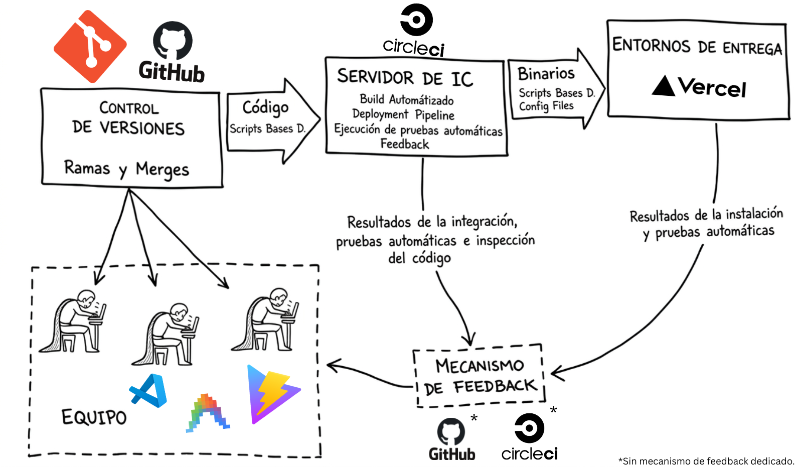

# CI/CD

Ejemplo simple de un entorno de integración continua, utilizando un repositorio de GitHub conectado a un servidor de integración continua (CircleCI) y un entorno de entrega (Vercel).

## Tecnologías/Servicios utilizados

* VisualStudio Code (IDE)
* Antigravity CLI (Agente IA)
* React (Framework JavaScript)
* Vite (Herramienta de construcción)
* Git (Control de versiones)
* GitHub (Repositorio remoto)
* Vitest (Framework de pruebas unitarias)
* CircleCI (Plataforma de CI/CD)
* Vercel (Plataforma de hosting)

## Descripción

El proyecto en sí es una simple aplicación web con un "Hola, mundo" en pantalla. Se incluye un test unitario que verifica que la frase mostrada en pantalla empiece con mayúscula.

Cualquier cambio realizado en la rama principal (main) pasará por el pipeline de integración continua, que incluye dos fases: el `test` y `deploy`. Si la fase de test falla, el deploy no se ejecutará, y los cambios no pasarán al entorno de entrega.

Los resultados de las builds puede verificarse desde el GitHub del proyecto, aunque para una descripción más detallada de los mismos puede verse en el dashboard de CircleCI

## Creditos

Hecho por **Tomás Azula** para la materia **Ingeniería y Calidad de Software** de la UTN FRRe.
